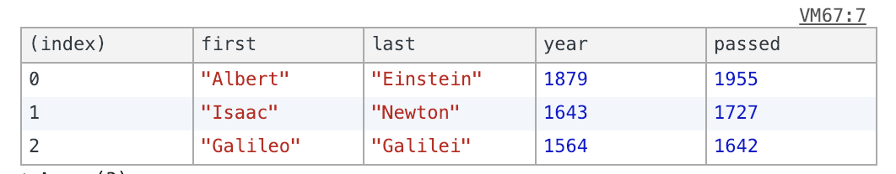

## Tips & tricks

##### Show a table in the console 

```javascript
const inventors = [
  { first: 'Albert', last: 'Einstein', year: 1879, passed: 1955 },
  { first: 'Isaac', last: 'Newton', year: 1643, passed: 1727 },
  { first: 'Galileo', last: 'Galilei', year: 1564, passed: 1642 }
]

console.table(inventors);
```
Output:


----